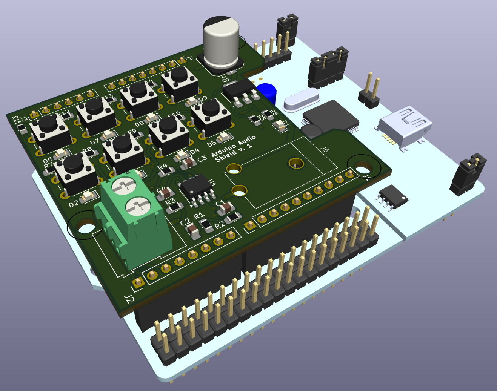
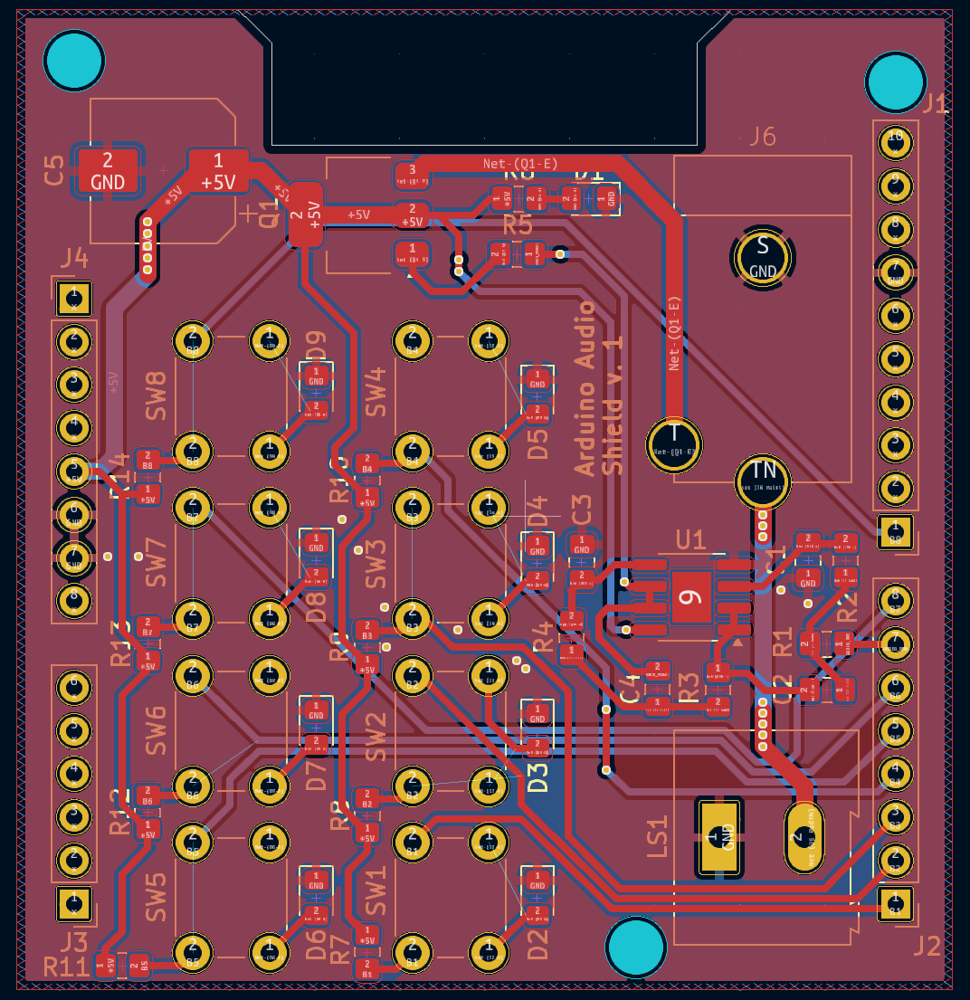
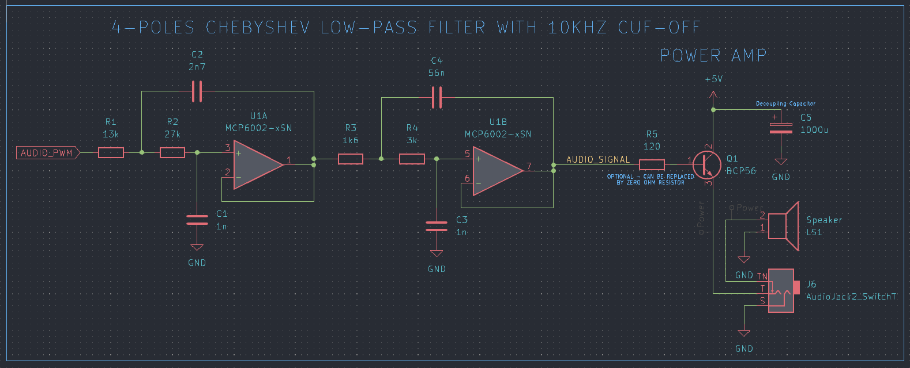

# Audio shield

The project is an audio shield for STM32 nucleo board or any other board compatible with arduino uno connectors. The board is generating analog audio signal in bandwidth up to 10 kHz. Sound output can be switched between headphones (mono) or speaker. Additionally keyboard with 8 switches is added to program special sounds etc. to generate.

## RC filter

To amplify a signal in desired bandwidth, a 4th order lowpass Chebyshev filter was used, because of its step roll-off characteristics. Filter was designed with a use of Texas Instruments Filter Design Tool:
https://webench.ti.com/filter-design-tool/filter-type

## Software

- KiCad v.8.0